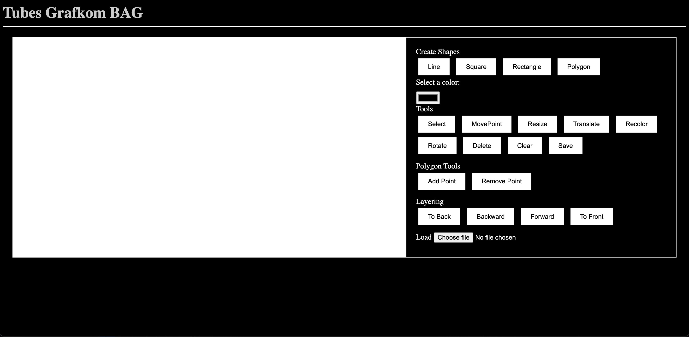

# Tugas Besar 1 IF3260 - Grafika Komputer

Computer-Aided Design (CAD) 2 Dimensi Berbasis Web menggunakan WebGL

## Anggota Kelompok BAG

- 13521081 Bagas Aryo Seto
- 13521103 Aulia Mey Diva Annandya
- 13521106 Mohammad Farhan Fahrezy

## Deskripsi

Aplikasi 2D Web Based CAD yang dibangun merupakan aplikasi web interaktif yang memungkinkan pengguna untuk menggambar, mengedit, dan memvisualisasikan sejumlah model geometris seperti garis, persegi, persegi panjang, dan poligon pada canvas. Aplikasi ini dibangun menggunakan bahasa pemrograman JavaScript dengan bantuan library WebGL sebagai pemroses grafispada elemen HTML5 canvas.

## Fungsionalitas

1. Menggambar dan Mengedit Model Geometris
2. Transformasi Geometri
3. Interaksi Titik Sudut
4. Kustomisasi Warna
5. Simpan dan Muat Model
6. Layering
7. Hapus Model dan Bersihkan Kanvas

## Cara Menjalankan Program

1. Unduh ZIP atau clone repository ini
2. Ekstrak dan akses direktori `src` hasil ekstraksi dari repository ini
3. Jalankan `index.html` dan secara otomatis akan membuka browser default untuk menjalankan file `.html`
4. Jika WebGL tersedia pada browser, maka canvas akan muncul dan dapat langsung menggambar
